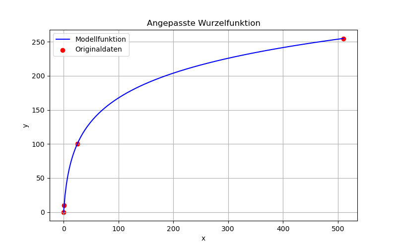

# Helligkeitsfunktion

**Datum:** 17.September 2025  
**Ersteller:** Miro Sieber

## Wiso eine Helligkeitsfunktion?
Damit die LED bei sonnenschein sichtbahr ist und nachts nicht blendet, muss die Helligkeit der LED an die Umgebungshelligkeit angepasst werden. 
Dies geschiet durch eine Helligkeitsfunktion, die den Eingabewert (Umgebungshelligkeit in Lux) in einen Ausgabewert (Helligkeit der LED von 0-255) umwandelt.
Versuche mit einer linearen Funktion zeigen, dass diese bei wehnig licht zu flach und bei viel licht zu steil ansteigt.
Dies hatte zur folge, dass am Abend die LED ausgelöscht hatte, befor das Umgebungslicht tief genug war. 
Desswegen wird nun eine Wurzelfunktion verwendet, die bei tiefen Werten steiler ansteigt und bei hohen Werten flacher wird.

## Das Programm Wurzelfunktion.py:

Dieses Programm berechnet eine Wurzelfunktion die durch drei gewünschte Helligkeitswerte definiert wird.
Die resultierende Funktion hat die Form:

$$
f(x) = a \cdot \sqrt{b \cdot x + c} + d
$$

wobei x der Eingabewert in lux und f(x) der resultierende Helligkeitswert (0-255) der LED ist.
Die Parameter a, b, c und d werden so berechnet, dass die Funktion durch die drei angegebenen Punkte (x1, y1), (x2, y2) und (x3, y3) verläuft.

diese parameter können anschliessend im Cpp Programm (RGB.cpp) eingefügt werden.
