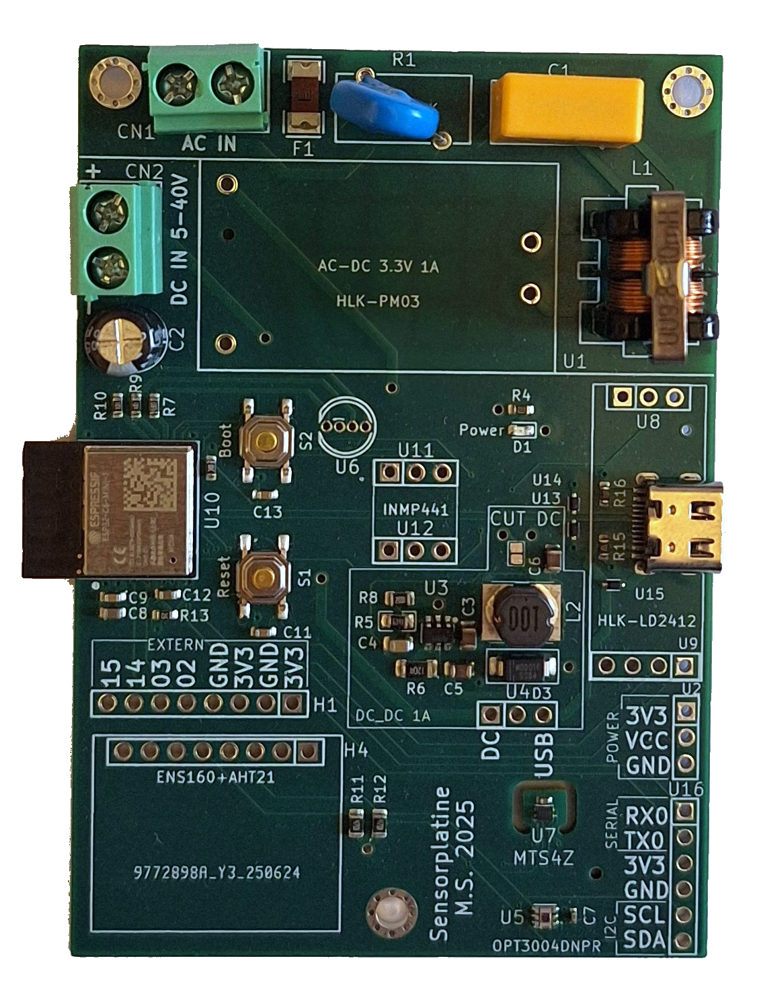

# OmniSensHome

**A Comprehensive Smart Home Multi-Sensor Platform Based on ESP32-C6 with Zigbee Communication**

[](LICENSE)
[](https://github.com/espressif/esp-idf)
[](https://www.espressif.com/en/products/socs/esp32-c6)

## Table of Contents

- [Overview](#overview)
- [Documentation](#documentation)
- [Key Features](#key-features)
- [Hardware](#hardware)
  - [Custom PCB Design](#custom-pcb-design)
  - [Supported Sensors](#supported-sensors)
  - [Supported Actuators](#supported-actuators)
  - [Pin Configuration](#pin-configuration)
- [Software Architecture](#software-architecture)
  - [FreeRTOS Tasks](#freertos-tasks)
  - [Zigbee Endpoints](#zigbee-endpoints)
- [Getting Started](#getting-started)
- [Configuration](#configuration)
- [Zigbee Integration](#zigbee-integration)
- [Features](#features)
  - [RGB LED Status Indicator](#rgb-led-status-indicator)
  - [Intruder Alarm System](#intruder-alarm-system)
  - [Contact Switches](#contact-switches)
  - [Relay Control](#relay-control)
- [Troubleshooting](#troubleshooting)
- [Contributing](#contributing)
- [License](#license)
- [Acknowledgments](#acknowledgments)

---

## Overview

OmniSensHome is a versatile, modular smart home sensor platform built on the ESP32-C6 microcontroller that communicates via **Zigbee 3.0**. The project allows you to create custom multi-sensor devices that can monitor various environmental parameters, control actuators, and integrate seamlessly with home automation systems like **Zigbee2MQTT** and **Home Assistant**.

The system is designed with flexibility in mind - a single firmware can support multiple hardware configurations through a JSON-based configuration file. This approach eliminates the need to recompile code for different sensor combinations.

**Created by:** Miro Sieber

---

## Documentation

- [System architecture](Dokumentation/Software_Struktur.md)
- [Sensors and wiring](Dokumentation/Sensoren.md)
- [Config file format and examples](Dokumentation/Config_File.md)
- [OTA update process](Dokumentation/OTA.md)

---

## Key Features

✨ **Multi-Sensor Support**
- Temperature monitoring (MTS4Z, AHT21)
- Humidity sensing (AHT21)
- Air quality monitoring (ENS160: eCO2, TVOC, AQI)
- Ambient light sensing (OPT3004)
- Sound level monitoring (INMP441)
- Presence detection (LD2412 radar sensor)
- Contact switches for doors/windows

🔧 **Flexible Actuator Control**
- Up to 4 relay outputs (NO/NC supported)
- RGB LED status indicator with automatic brightness adjustment
- Audio speaker for alarms/notifications
- Buzzer for alerts

🌐 **Zigbee 3.0 Integration**
- Native Zigbee 3.0 support via ESP32-C6
- Works as router (always-on) or end-device (battery-powered)
- Over-The-Air (OTA) firmware updates with delta compression
- Seamless integration with Zigbee2MQTT

📝 **Configuration-Driven Design**
- JSON-based hardware configuration
- Single firmware for multiple hardware variants
- No code recompilation needed for different sensor setups

🔒 **Security Features**
- Intruder alarm system
- Door/window contact monitoring
- Presence-based security

---

## Hardware

### Custom PCB Design

OmniSensHome is built on a **custom PCB** based on the **ESP32-C6 Mini** module. The PCB integrates all necessary sensor interfaces, and peripheral connectors.

**PCB Documentation:**
- [Schematic & Design Files](https://github.com/mirosieber/OmniSensHome-Hardware) *(Link to hardware repository placeholder)*
<table>
  <tr>
    <td></td>
    <td></td>
  </tr>
  <tr>
    <td>Custom PCB</td>
    <td>Custom Case</td>
  </tr>
</table>

### Supported Sensors

| Sensor | Type | Measurement | Interface |
|--------|------|-------------|-----------|
| **OPT3004** | Illuminance | 0-83,000 Lux (0.01 Lux resolution) | I²C |
| **MTS4Z** | Temperature | ±0.1°C accuracy | I²C |
| **AHT21** | Temperature & Humidity | ±0.5°C, ±3% RH | I²C |
| **ENS160** | Air Quality | eCO2, TVOC, AQI | I²C |
| **INMP441** | Sound Level | Noise level in dB | I²S |
| **LD2412** | Presence/Motion | Human presence detection | UART |
| **Contact Switches** | Binary | Door/window status | GPIO |

### Supported Actuators

| Actuator | Type | Description | Interface |
|----------|------|-------------|-----------|
| **Relays (1-4)** | Switching | NO (Normally Open) or NC (Normally Closed) | GPIO |
| **RGB LED** | Status Indicator | Air quality visualization with auto-brightness | GPIO (PWM) |
| **Speaker** | Audio Output | Alarm tones and notifications | I²S |
| **Buzzer** | Audio Alert | Simple alarm tones | GPIO |

### Pin Configuration

The ESP32-C6 has limited external GPIO pins available for peripherals:

**Available External GPIOs:** 2, 3, 14, 15

**Fixed I²C Pins:**
- SDA: Configurable in config file
- SCL: Configurable in config file

**I²S Pins (Speaker/Microphone):**
- LRC, BCLK, DIN: Configurable (note: some pins shared with microphone)

⚠️ **Important:** Ensure no GPIO pin is assigned to multiple functions to avoid hardware conflicts or damage!

---

## Software Architecture

OmniSensHome is built on **FreeRTOS** and utilizes a multi-tasking architecture where each sensor and actuator runs in its own dedicated task. The system is highly modular and only creates tasks for sensors/actuators that are enabled in the configuration file.

### FreeRTOS Tasks

| Task Name | Description | Always Running? |
|-----------|-------------|-----------------|
| **MainTask** | System initialization, Zigbee factory reset button monitoring | ✅ Yes |
| **ZigbeeMain** | Zigbee communication, OTA updates, routing | ✅ Yes |
| **Lux Sensor Task** | OPT3004 sensor reading, RGB LED brightness adjustment | Only if enabled |
| **Temperature Task** | MTS4Z sensor reading | Only if enabled |
| **Temp/Humidity/AQ Task** | AHT21 + ENS160 sensor reading, air quality monitoring | Only if enabled |
| **Sound Level Task** | dB sensor reading | Only if enabled |
| **Presence Task** | LD2412 radar sensor data processing | Only if enabled |
| **UART Event Task** | LD2412 UART communication | Only if LD2412 enabled |
| **UART TX Task** | LD2412 command transmission | Only if LD2412 enabled |
| **UART RX Task** | LD2412 data reception | Only if LD2412 enabled |
| **Contact Switch Task** | Door/window contact monitoring | Only if enabled |
| **Relay Control Task** | Relay output control, button/switch handling | Only if enabled |
| **Speaker Task** | Alarm audio playback | Only if enabled |
| **Buzzer Task** | Alarm tone generation | Only if enabled |

### Zigbee Endpoints

The system uses multiple Zigbee endpoints to organize different functionalities:

| Endpoint | Function | Cluster Type |
|----------|----------|--------------|
| 1 | Range Extender (message routing) | Router |
| 2 | Illuminance Sensor (Lux) | Illuminance Measurement |
| 3 | Temperature Sensor (OTA capable) | Temperature Measurement |
| 4 | Temperature & Humidity Sensor | Temperature + Humidity |
| 5 | eCO2 Sensor | Carbon Dioxide Measurement |
| 6 | Sound Level Sensor (dB) | Analog Input |
| 7 | Presence Sensor | Occupancy Sensing |
| 8-11 | Contact Switches 1-4 | Binary Input |
| 12-15 | Relays 1-4 | On/Off Output |
| 16 | TVOC Sensor | Carbon Dioxide Measurement |
| 17 | RGB LED | Dimmable Light |
| 18 | LD2412 Bluetooth Control | On/Off |
| 19 | Audio Gong Trigger | On/Off |
| 20 | Intruder Alarm Activate | On/Off |
| 21 | Intruder Detected Status | Binary Sensor |
| 22 | Air Quality Index | Carbon Dioxide Measurement |
| 23 | Zigbee Device Reset | On/Off |
| 24 | Alarm Trigger | On/Off |

---

## Getting Started

Quick path:
1) Install [ESP-IDF v5.x](https://docs.espressif.com/projects/esp-idf/en/latest/esp32c6/get-started/) and Python 3.x.
2) Clone the repo and build:
   ```bash
   git clone https://github.com/mirosieber/OmniSensHome.git
   cd OmniSensHome
   idf.py build
   ```
3) Flash firmware: `idf.py -p <PORT> flash`
4) Upload JSON config via **[ESP32DataFlasher](https://github.com/mirosieber/ESP32DataFlasher)** to the SPIFFS partition.
5) Optional: `idf.py -p <PORT> monitor`

Full setup details live in [Dokumentation/Config_File.md](Dokumentation/Config_File.md) and [Dokumentation/OTA.md](Dokumentation/OTA.md).

---

## Configuration

Configuration is entirely JSON-driven and stored in SPIFFS. See [Dokumentation/Config_File.md](Dokumentation/Config_File.md) for the full schema, examples, and pin mappings. Key points:
- One firmware, multiple hardware variants via config
- Defines device info, I²C pins, RGB LED, speaker/buzzer, sensors, switches, relays
- Upload/update configs with [ESP32DataFlasher](https://github.com/mirosieber/ESP32DataFlasher); erase flash first when changing hardware combos

---

## Zigbee Integration

- Pairing, interview flow, and permit-join steps are outlined in [Dokumentation/OTA.md](Dokumentation/OTA.md).
- delta OTA instructions, Zigbee2MQTT config snippet, and release workflow also live there.
- Tip: after changing endpoints or hardware config, factory-reset and re-interview via Zigbee2MQTT.

---

## Features

### RGB LED Status Indicator

The RGB LED provides visual feedback about air quality:

| Color | Air Quality | Description |
|-------|-------------|-------------|
| 🔵 Blue | Excellent | Very good air quality |
| 🟢 Green | Good | Good air quality |
| 🟡 Yellow | Moderate | Moderate air quality |
| 🔴 Red | Poor | Poor air quality |
| 🟣 Purple | Very Poor | Very poor air quality |
| ⚪ White (blinking) | - | Zigbee pairing mode |

**Auto-Brightness:**
- LED brightness automatically adjusts based on ambient light (OPT3004 sensor)
- Turns off at night for comfortable sleeping
- Brightness can be fine-tuned via Zigbee commands

### Intruder Alarm System

OmniSensHome can function as a security alarm system:

**Features:**
- Activate/deactivate via Zigbee endpoint 20
- Monitors contact switches (doors/windows)
- Monitors presence sensor (LD2412)
- Triggers audio alarm (speaker or buzzer) when intrusion detected
- Sends alert to Zigbee coordinator
- Status reported via endpoint 21

**Acoustic Alarm:**
- Speaker plays WAV file alarm tone
- Buzzer plays hardcoded alarm tone
- Can be triggered directly via Zigbee (endpoint 24)

### Contact Switches

Up to 4 contact switches for monitoring doors and windows:
- Pull-up resistor enabled
- Switch must pull pin to GND when closed
- Reports status via Zigbee endpoints 8-11

### Relay Control

Up to 4 relays can be controlled:
- Supports both NO (Normally Open) and NC (Normally Closed) relays
- Can be paired with buttons/switches automatically
- Handles both momentary buttons and toggle switches
- Reports status via Zigbee endpoints 12-15

**Automatic Pairing:**
The relay control task automatically pairs active relays with active buttons/switches in sequential order. For example, if Button 2 and Relay 4 are the only active ones, they will be paired together.

---

## Troubleshooting

1. **Device not pairing with Zigbee:**
   - Press factory reset button
   - Check if LED is blinking white
   - Ensure Zigbee2MQTT has "Permit Join" enabled

2. **Config file not loading:**
   - Verify JSON format is correct
   - Check file size matches partition table
   - Re-upload config using [ESP32DataFlasher](https://github.com/mirosieber/ESP32DataFlasher)

---

## Contributing

Contributions are welcome! Please feel free to submit issues or pull requests.

---

## License

This project is licensed under the MIT License - see the [LICENSE](LICENSE) file for details.

---

## Acknowledgments

- **Espressif Systems** for the ESP32-C6 and ESP-IDF framework
- **Zigbee2MQTT** community for excellent home automation integration
- **SparkFun** for the ENS160 library
- **Arduino** community for ESP32 Arduino framework

---

## Contact

**Author:** Miro Sieber  
**Repository:** [github.com/mirosieber/OmniSensHome](https://github.com/mirosieber/OmniSensHome)

For issues and feature requests, please use the [GitHub Issues](https://github.com/mirosieber/OmniSensHome/issues) page.

---

## Additional Resources

- [ESP32-C6 Documentation](https://docs.espressif.com/projects/esp-idf/en/latest/esp32c6/)
- [Zigbee2MQTT Documentation](https://www.zigbee2mqtt.io/)
- [ESP-IDF Programming Guide](https://docs.espressif.com/projects/esp-idf/en/latest/)
- [FreeRTOS Documentation](https://www.freertos.org/Documentation/RTOS_book.html)

---
